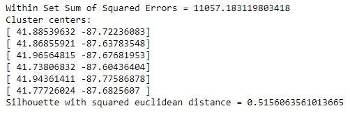
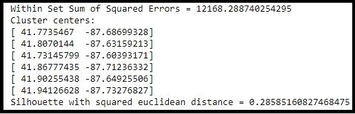
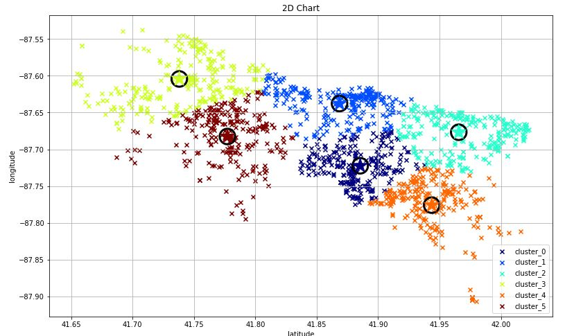
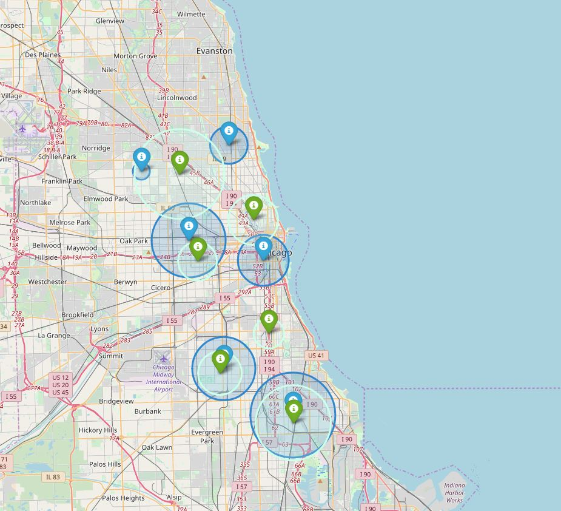

# Spark MLlib: Clustering Analysis of Chicago Crime Locations Dataset

Using as input data the crime of Chicago dataset, we have developed a Jupyter notebook that perform a clustering of the locations (latitude, longitude) after asking for the number of clusters and using two of the clustering algorithms in **SparkML**:
- Kmeans Model
- Bisection Kmeans Model

the Chicago Dataset can be located in: [data.cityofchicago.org](https://data.cityofchicago.org/Public-Safety/Crimes-2001-to-present/ijzp-q8t2).

The results plot include a 2D chart the centroids and the points of each cluster. These information has been also plotted on top of a map of Chicago.

**Summary of results**

- *Chicago Crime Locations* dataset:

Location of all the clusters by colors in a 2D Map:

